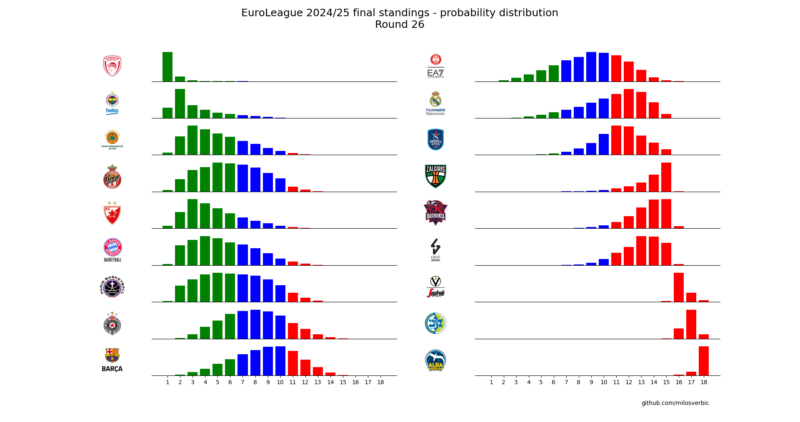

# Euroleague-Elo

This is a basic prediction model based on Elo ratings used to predict the outcome of Euroleague games. Each team starts with the same rating, and throughout the season they gain and lose rating points. Unlike the classic Elo model, this model doesn’t calculate the expected result of games only using the ratings of the two teams, it also gives a rating boost to the home team used only for calculating the expected result, which also affects the amount of rating points won/lost from that game.

The model uses 2 parameters, the K-factor, used to determine the amount of points won/lost after each game, and the rating boost given to the home team (the “H-factor”). These parameters were determined using the game data of every season from 2016/17 to 2023/24, excluding 2019/20 and 2021/22. The first part of the season (first 26 rounds) was used only to find the rating of each team. The last part of the season was used to compare the prediction of the model with the real results. The K and H values, where the sum of squares of the model’s error was minimal, were selected (k=47, h=90).

The Python library `euroleague-api` was used to gather game data.

This model can be used to predict a team’s chances of winning any specific game. Here it was used to find every team’s chance of finishing the season at each position in the standings, based on 10000 simulations. The model can only predict whether a team wins or loses, it can’t predict the point difference, so the final standings are only based on wins and losses and don’t take into account point differential.

`save_game_data.py` is used to gather game data and saves it to the files `playedGames.csv` and `upcomingGames.csv`. If these files aren’t present when running `sim_position.py` or `graph_distribution.py`, `save_game_data.py` automatically gets run. 

`sim_position.py` runs 10000 simulations of the final standings and saves the results to `pos_(number of games played).csv`.

`graph_distribution.py` is used to graph each team’s chance of finishing the season at any position, based on the results stored in `pos_(number of games played).csv`. The number of games played is determined by the number of games in `playedGames.csv`.

If the game data in `playedGames.csv` and `upcomingGames.csv` is outdated, either delete both files or run `save_game_data.py` to update it.

